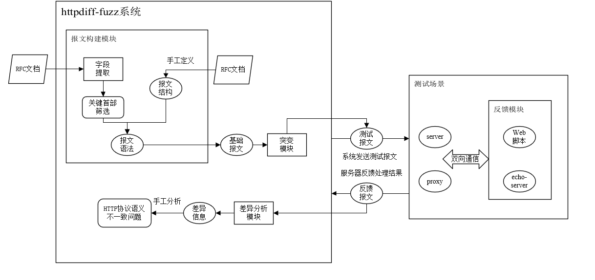

## httpdiff-fuzz
基于原型系统t-reqs开发的httpdiff-fuzz用于测试HTTP协议语义不一致问题。
### 系统整体的架构

### 改进的工作：
1. 基于关键首部的报文构建方法
httpdiff-fuzz提出关键首部的概念，在特定的环境下，只有部分首部的测试报文是有意义的，将这些语义能被表达的首部判定为关键首部，可以降低测试报文的空间，并保留语义特征。
./normal-test.py 文件中实现了关键首部选择算法，通过首部语义的变化，观测测试结果是否变化，从而断定首部是否为关键首部。

2. 基于字段语义的突变策略
httpdiff-fuzz扩展t-reqs中基于语法树的突变，将节点定义扩展为数值型，字符型，首部型和特殊类型，并依据节点类型，提供定向的突变方法。
fuzz/fuff.py 文件中实现了各类节点对应的突变方法，建立在语法树突变的基础上，按照特定的要求格式化处理报文字段。

3. 扩展的报文分析角度
httpdiff-fuzz扩展报文分析的角度，将观测整个通信过程的报文（请求报文和响应报文的字段），涵盖现有与语义不一致问题的场景（基于URI的访问控制绕过，Double Hosts,HRS,CPDoS,流量不对称问题）
diff/diff_tmp.py 文件中实现了扩展的报文差异分析算法

### Run

#### 环境搭建
python 搭建系统运行环境requirements
若测试对象为反向代理模式，需要将请求报文转发到echo_server.py
若测试对象为服务端模式，需要配置php脚本，将./index.php映射到服务器的默认接口
系统暂不支持其它工作模式

#### 前期工作（可选,语法文件配置）
- rfc/*.json 中已有收集的字段信息，可以自行扩展
- config文件中指定测试目标
- ./normal-test.py 关键首部测试，将测试获取的首部信息，输入到- grammar/grammarGen.py 重新生成语法文件，用生成的语法替换config中已有的语法
- 依据自身经验调整config文件中对节点类型的声明(不建议)

#### 差异问题测试(核心)
- config文件中指定测试目标
- ./fuzz-test.py 指定随机种子的大小，将构建从1-seeds数目的测试报文用于测试，可以在fuzz-test.py参数中指定保存服务器结果的文件。
- diff/diff_tmp.py 分析服务器测试的结果，获取测试结果之间存在的差异信息

#### 手工分析语义不一致问题(待完善)
从差异信息中可以判定服务器处理的行为是否存在问题，但目前没有一个良好的分类方法，从差异信息中找到具体的语义不一致问题。
定位特定字段的差异，如Content-Length或Transfer-Encoding首部处理的差异找到可能的请求走私问题。
后续将进一步改善。
